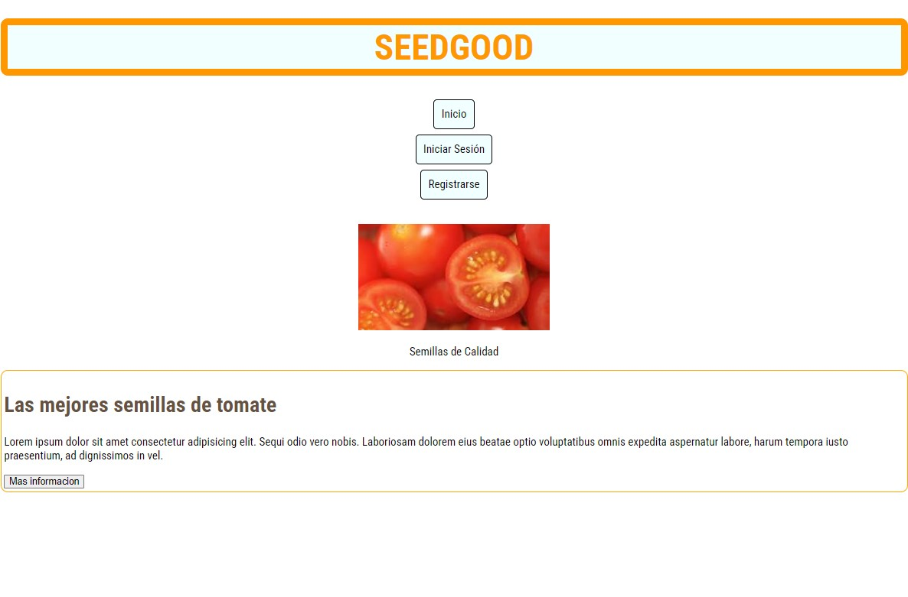
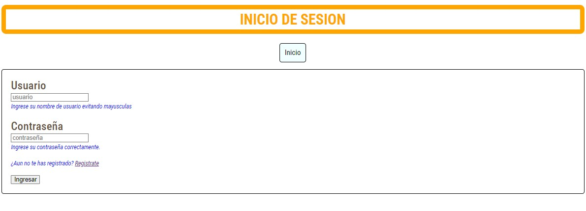
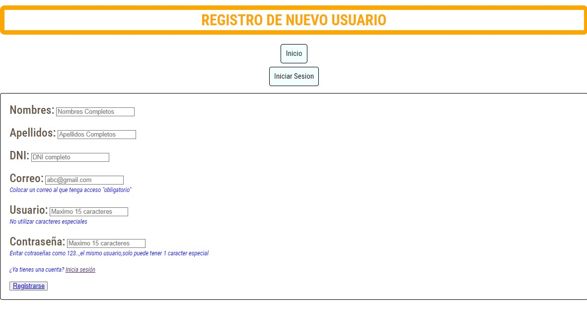

# TAREA

_Dado que ahora hemos visto un poco de CSS deveras usar tu pagina anterior y agregar las modificaciones correspondientes. Dichas modificaciones deben incluir un nuevo diseño en cada apartado.
Para tener un orden, tu proyecto deberá estar en un nuevo repositorio. Además de crear un readme explicando el uso de las propiedades que has utilizado en tu pagina web, como adicional a esto en el propio readme adjuntar captura de pantalla de la pagina._
___

## EXPLICACION
1.	font-family: define una lista de fuentes
2.	box-sizing: Controla cómo se calculan el ancho y el alto de un elemento.
3.	color: sirve para poder cambiar el color al texto
4.	font-size: sirve para poder agrandar el texto, en base a *px* (pixeles)
5.	font-weight: especifica el peso o groso de la letra de 100 a 900
6.	text-align: sirve para alinear un bloque de texto
7.	padding: sirve para añadir un espacio dentro de un elemento
8.	border: sirve para agregar borde a un elemento
9.	border-radius: sirve para redondear las esquinas de un borde
10.	background-color: sirve para dar color al fondo de un elemento
11.	margin-top: Añade espacio fuera de un elemento, en la parte superior.
12.	text-decoration: Especifica si la etiqueta tendra un borde
13.	font-style: Cambia el estilo del texto  a cursiva

## IMAGENES
-   **PAGINA PRINCIPAL DE PAGINA WEB**

-  **PAGINA DE INICIO DE SESION**

- **PAGINA DE REGISTRO DE USUARIO**

